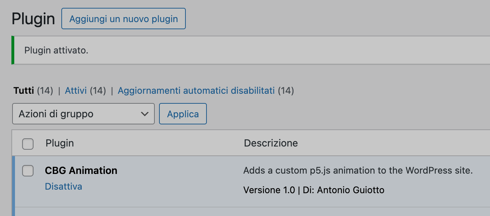

### Wordpress Plugin for introduction animation CBG Creative Studio

Addition for loading on the homepage
```html
<div id="cbg-animations-overlay" style="position: fixed; top: 0; left: 0; width: 100%; height: 100%; background-color: #F0EBE6; z-index: 12004;">
    <div id="cbg-animations-overlay-logo" style="position: absolute; left: 50%; transform: translateX(-50%);">
        <div style="position: relative;position: relative;width: 172px;height: 0;">
            <div style="background: #f79b00; height: 80px; width: 80px; border-radius: 100%; position: absolute; bottom: -80px; left: 90px;"></div>
            <div style="position: absolute; background: #000; height: 80px; width: 80px; border-radius: 100%; left: 60px; bottom: -50px;"></div>
            <h1 style="margin: 0; font-weight: 400; font-size: 1.2rem; line-height: 1.4rem;">CBG</h1>
        </div>
    </div>
</div>
```

